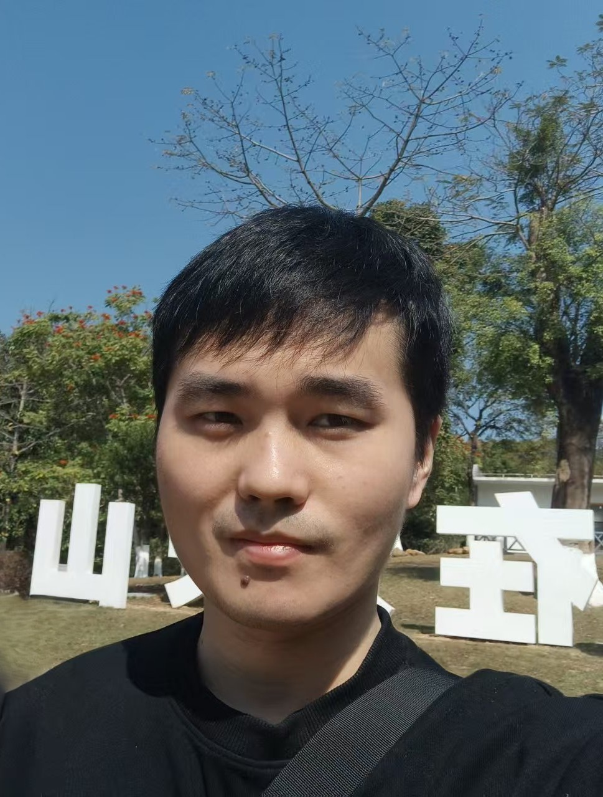

\---

title: "Biography"

layout: "simple"

\---

<!-- I am currently a graduate student at Hainan University, with research interests spanning computer vision, medical image analysis, and AI for biological data. My early work focused on image segmentation tasks, including gland segmentation in histopathological images, where I explored attention-based architectures and deep learning methods to improve boundary accuracy.-->

More recently, my research has shifted toward large-scale models for biological applications. I am particularly interested in gene function and structural annotation using foundation models, as well as cell trajectory generation and modeling. My goal is to leverage advanced AI techniques to better understand complex biological systems and enable data-driven discoveries.

In addition to my research, I have gained hands-on industry experience through several internships.

\## Internship Experience

\- \*\*Feb 2024 – Jun 2024\*\*, Hainan Borui Public Relations Co., Ltd.  

&#x20; Developed a system for calculating industrial processing coefficients, focusing on data processing and system implementation.

\- \*\*Jul 2024 – Feb 2025\*\*, Zhongshan Jiulian Software Technology Co., Ltd.  

&#x20; Built an automated menu extraction system, improving efficiency in structured information extraction tasks.

\- \*\*Jun 2025 – Oct 2025\*\*, Shanghai Naixin Software Technology Co., Ltd.  

&#x20; Developed an automated image segmentation and denoising software, applying deep learning techniques to enhance image quality and processing efficiency.

Overall, I aim to design robust and scalable AI systems that bridge computer vision and biological data analysis, with applications in both industrial and biomedical domains.

\### Contact

23210701000027@hainanu.edu.cn;chnan0027@gmail.com

 

\## Professional Services

\- \*\*Regular Reviewer:\*\*

&#x20; - Biomedical Signal Processing and Control

&#x20; - Journal of Big Data

 

\## Misc

I enjoy working on challenging projects, especially in areas that align with my interests, such as image processing, semi-supervised learning, object detection and tracking, as well as large model training and fine-tuning. Successfully completing these projects gives me a strong sense of accomplishment and motivates me to further explore advanced techniques in these fields.

